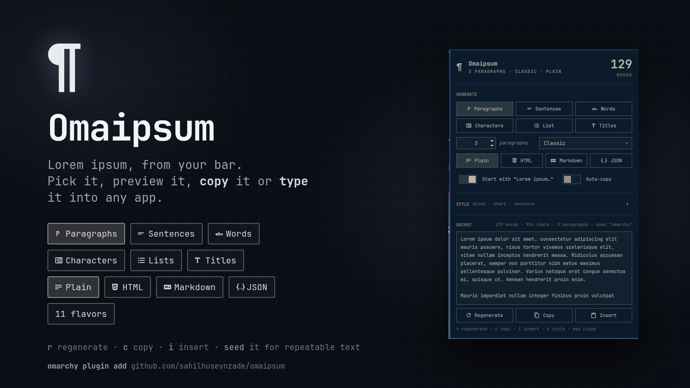

# Ipsumbar

**Lorem ipsum generator for [Omarchy](https://omarchy.org).**
A pilcrow in your bar; click it and a panel lets you dial in exactly the
placeholder text you need, then copy it or type it straight into the
focused app.



## Features

- **Six units** — paragraphs, sentences, words, characters (exact length),
  list items, and titles.
- **Eleven flavors** — Classic lorem ipsum, the original Cicero passage
  (*De finibus* 1.32–33, read in order), plain English, Hipster, Bacon,
  Cupcake, Corporate, Pirate, Cat, Space, and Developer.
- **Four formats** — plain text, HTML (`<p>`, `<h2>`, `<ul>`/`<ol>`),
  Markdown, and JSON (an array of the generated units, or
  `{title, body}` pairs when headings are on).
- **Style** — sentence length (short / medium / long / mixed), paragraph
  length, case (sentence / lower / UPPER / Title), bullet or numbered
  lists, a heading before every paragraph, and an optional **seed** so
  the same settings always produce the same text.
- **Start with the opening** — “Lorem ipsum dolor sit amet…” (each flavor
  has its own), or skip it.
- **Live preview** with word / character counts; **auto-copy** on every
  change if you want it.
- **Copy** to the clipboard, or **Insert**: the panel closes and the text
  is pasted into whatever window had focus.
- **Keyboard** — `r` regenerate · `c` / `Enter` copy · `i` insert ·
  `s` toggle style · `j`/`k` scroll · `Esc` close · `Tab` next panel.
- **Bar clicks** — left opens the panel, middle copies a fresh batch with
  the current settings (with a notification), right inserts one.
- **IPC** for keybindings and scripts (below). Settings persist on the
  widget's own entry in `~/.config/omarchy/shell.json`, written by the
  shell through its plugin API, so they stay in sync across monitors and
  can also be edited in Setup › Plugins.

## Install

```bash
omarchy plugin add https://github.com/sahilhuseynzade/ipsumbar.git --enable
```

The 󰛘 widget lands in the right section of the bar. Move it with
`omarchy bar move shl.ipsumbar --section center`.

## Uninstall

```bash
omarchy plugin remove shl.ipsumbar
```

That removes the widget's entry, settings included, from the bar layout
in `~/.config/omarchy/shell.json`. The plugin writes no other files.

## Dependencies

Everything Ipsumbar runs ships with Omarchy: `/usr/bin/wl-copy`
(wl-clipboard) for the clipboard, `/usr/bin/wtype` for Insert, and
`/usr/bin/busctl` (systemd) to post the copy notification on
`org.freedesktop.Notifications`. Each is invoked by absolute path with a
fixed argv and a cleared environment (only `WAYLAND_DISPLAY`,
`XDG_RUNTIME_DIR`, or `DBUS_SESSION_BUS_ADDRESS` as needed); there is no
shell in the loop. No sudo or pkexec, no network access, and the plugin
never opens a file itself: settings are stored by the shell on the
widget's `shell.json` entry. Node.js is only needed to run the tests.

## IPC

```bash
omarchy-shell shell toggle shl.ipsumbar '{}'                       # open / close the panel
omarchy-shell shl.ipsumbar copy                                    # copy a fresh batch (current settings)
omarchy-shell shl.ipsumbar copyWith '{"unit":"words","count":50}'  # …with one-off overrides
omarchy-shell shl.ipsumbar insert                                  # paste a fresh batch into the focused app
omarchy-shell shl.ipsumbar insertWith '{"unit":"sentences","count":2}'
omarchy-shell shl.ipsumbar generate '{"unit":"titles","count":1}'  # print text to stdout
omarchy-shell shl.ipsumbar set '{"flavor":"pirate","format":"html"}'  # change saved settings (shell.json)
omarchy-shell shl.ipsumbar options                                 # print saved settings as JSON
```

Override keys match the entry fields in `shell.json`: `unit` (`paragraphs`, `sentences`,
`words`, `characters`, `list`, `titles`), `count`, `flavor` (`classic`,
`cicero`, `english`, `hipster`, `bacon`, `cupcake`, `corporate`, `pirate`,
`cat`, `space`, `dev`), `format` (`plain`, `html`, `markdown`,
`json`), `startWithOpening`, `sentenceLength`, `paragraphLength`
(`short`, `medium`, `long`, `mixed`), `textCase` (`sentence`, `lower`,
`upper`, `title`), `listType` (`bullets`, `numbered`), `headings`, `seed`.

A Hyprland binding that pastes three paragraphs wherever you are, in
`~/.config/hypr/bindings.lua`:

```lua
o.bind("SUPER SHIFT", "L", "exec", "omarchy-shell shl.ipsumbar insertWith '{\"unit\":\"paragraphs\",\"count\":3}'", "Insert lorem ipsum")
```

## Development

```bash
node --test tests/            # pure-logic tests (lib/Model.js)
omarchy plugin validate .     # manifest checks
```

Layout: `BarWidget.qml` (bar glyph, IPC), `Panel.qml` (UI, persistence,
clipboard), `lib/Model.js` (generation and formatting, no Qt — runs under
node as well as inside the shell). `docs/cover.html` renders `preview.png`
from `docs/panel.png` (a 440px-wide screenshot of the panel) in any browser
at 1600×900.

To hack on it, copy the checkout into `~/.config/omarchy/plugins/shl.ipsumbar/`;
the shell reloads plugin code on save. IPC handlers only re-register on a
shell restart, so run `omarchy restart shell` after editing `BarWidget.qml`.

## License

[MIT](LICENSE)
